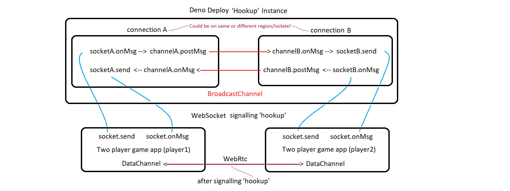

# DenoDice
   
## Two Player Poker Dice Game.
This two-player game leverages WebRtc and Deno-Deploy BroadcastChannel.

* Zero external dependencies 
   
* A single HTMLCanvas element with virtual Dom-like UI.

* Virtual DOM-like element-objects are hydrated from HTML and css.

The fun thing about the multiplayer game is that players are allowed    
to 'steal' other players score items if they roll a greater sum for that item.    

HeeHee ... snicker-sniker ...
Try it.
https://rtc-dice-app-server.deno.dev/    
   
Usage:
```
Open one or two instances of the app. 
Each instance will show a unique color icon in the tab.
This color will match the color of the `Roll-Button` to determin whos turn it is.

Click the 'Roll Button' to start.    
After each roll of the dice, you can 'click' a die to 'freeze' its value.    
Click again to toggle the frozen state.  
After three rolls, you must select a score item.    
The blue highlighted numbers indicate possible scores that are available to select.
You may steal any other players score-item if a blue score is shown.
Have fun!
```
App code at https://github.com/nhrones/RtcDiceApp

## Run the app from Deploy
https://rtc-dice-app-server.deno.dev/  

## Developed using my own custom framework (Surface)
## Interesting features
### Just a single DOM canvas element 
 * All objects on the screen are simply rendered to this canvas.<br/>
 
 * These objects exibit most of the functionality of DOM elements including:<br/>
     * hit testing    
     * click/touch     
     * mouse-in/out     
     * hovered     
     * events     

 * The container and all objects are decoupled on an internal event-bus<br/>
 
 * Objects are compiled and hydrated from custom html and css (svelte-like)<br/>
 * Compilation produces element-descripter objects. Compilation is controlled by<br/>
    a DEV flag, and element-descripter objects are persisted in localStorage.<br/>
 * Hydration uses these descripter objects to build virtual dom-like viewElement objects .<br/>
 * The dice objects build their own images during hydration.<br/> 
 * Each viewElement instantiates and initializes its own backing view-model during hydration.<br/> 
    Geometric attributes from html/css are used to configure Path2D objects for each.<br/>
    
### ZERO External Dependencies PURE Vanilla Typescript  

[]  
